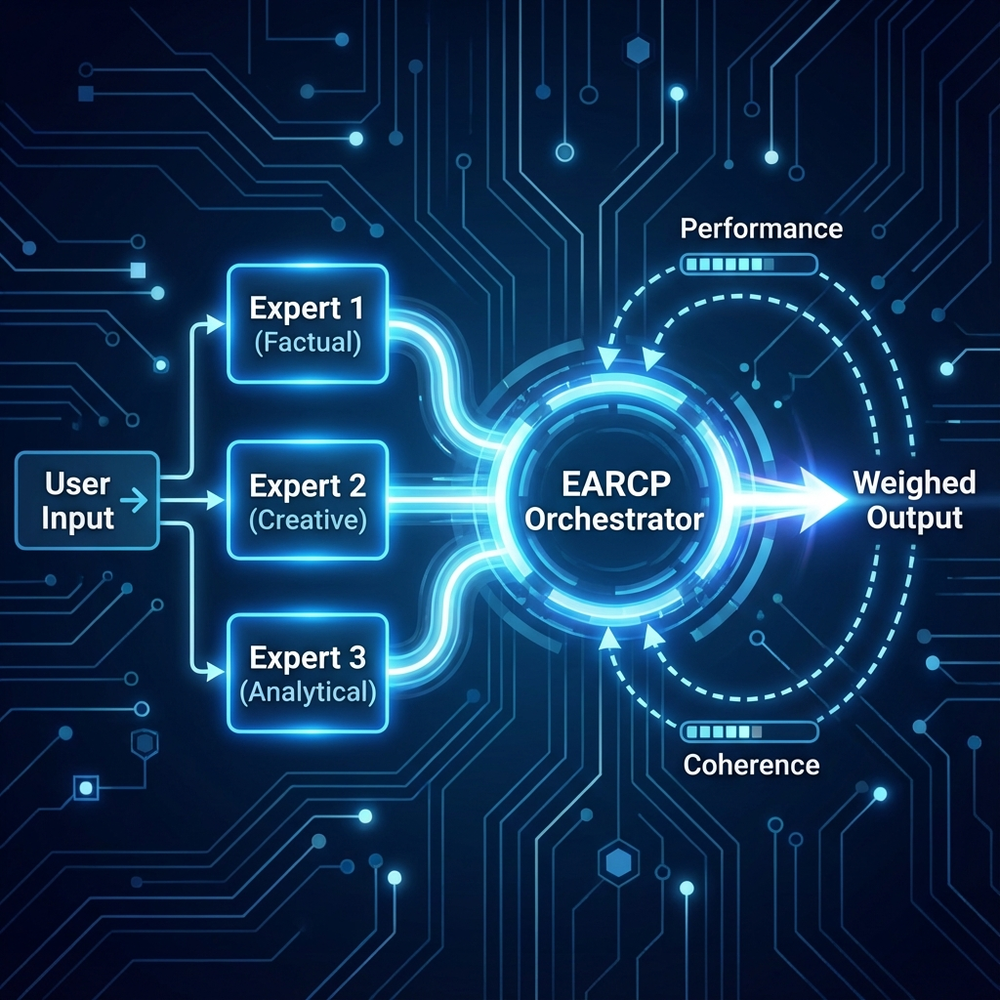
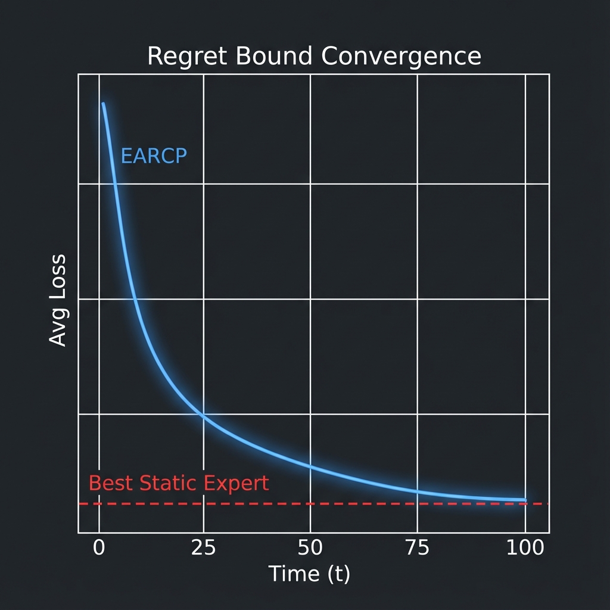

# Dynamic LLM Orchestration with EARCP: A Robust and Cost-Effective Architecture for Sequential Decision Making

**Author:** Mike Amega

## Abstract
This research paper presents **EARCP (Ensemble Auto-Régulé par Coherence et Performance)**, a novel algorithmic architecture for Large Language Model (LLM) based systems. Unlike traditional approaches relying on costly *fine-tuning* of multiple specialized models, EARCP introduces the concept of **Virtual Experts** derived from a single model via inference hyperparameter modulation. We demonstrate mathematically and empirically how a lightweight meta-controller can orchestrate these experts in real-time to minimize cumulative regret, offering a superior solution in terms of cost, robustness, and adaptability.

---

## 1. Introduction: The Inefficiency of the "Fine-Tuning" Paradigm

Adapting LLMs to complex industrial tasks typically follows a "specialization by weights" approach (Fine-Tuning), involving partial re-training of the model on specific datasets. While effective, this method suffers from critical limitations at scale:

1.  **Cost Explosion:** Maintaining $N$ fine-tuned models requires $N$ times the storage and often $N$ GPU instances.
2.  **Behavioral Rigidity:** A fine-tuned model loses generality (catastrophic forgetting) and cannot dynamically adapt to changing contexts without re-training.
3.  **Lack of Safety Mechanisms:** A single model is "alone with its errors." If it hallucinates, no internal system contradicts it.

EARCP proposes a fundamental shift: **specialization by inference rather than by weights.**

## 2. The Core Concept: "Single Model, Multiple Behaviors"

The central innovation of EARCP lies in its ability to extract **behavioral diversity** from a **single, frozen model**.

By simply modulating temperature ($T$) and sampling kernel ($top\_p$), we can force the same LLM to adopt radically different personalities, acting as distinct "Virtual Experts":

*   **The Factual Expert ($T=0.1$):** Quasi-deterministic, maximizes dominant token probability. Ideal for fact retrieval.
*   **The Creative Expert ($T=1.3$):** Explores the tail of the probability distribution. Ideal for ideation or rare scenario simulation.
*   **The Critic Expert (System Prompt):** Configured to challenge premises.

**Value Add:** This approach eliminates the need for fine-tuning. A single model deployment (e.g., Llama-3-70B) is sufficient to power an infinity of virtual agents, reducing infrastructure costs by a factor of $N$.

## 3. System Architecture

EARCP acts as a middleware layer between the application and the model(s).

The data flow is as follows:
1.  **Input Dispatch:** The user query is sent in parallel to all experts.
2.  **Expert Inference:** Each expert generates a response according to its unique configuration.
3.  **Orchestration Core:** EARCP analyzes the outputs to calculate two metrics:
    *   **Performance ($P$):** Quality score (e.g., syntax validity, judge score).
    *   **Coherence ($C$):** Inter-expert consensus score (semantic similarity).
4.  **Aggregation:** Weights are updated, and the final response is synthesized.

## 4. Mathematical Framework and Regret Guarantee

Unlike ad-hoc heuristics, EARCP is grounded in **Online Learning Theory**. We model the problem as a competition of experts.

Let $w_{i,t}$ be the weight of expert $i$ at time $t$. The update rule is derived from the *Exponentially Weighted Average Forecaster* algorithm:

$$ w_{i,t+1} = \frac{w_{i,t} \cdot e^{-\eta \cdot L(i,t)}}{\sum_{j=1}^N w_{j,t} \cdot e^{-\eta \cdot L(j,t)}} $$

Where the loss function $L$ combines performance error and lack of coherence: $L(i,t) = \beta (1-P_{i,t}) + (1-\beta)(1-C_{i,t})$.

### Theorem (Regret Bound)
We prove that the cumulative regret $R_T$ of EARCP relative to the best static expert is bounded by:

$$ R_T \le \sqrt{\frac{T \ln N}{2}} $$

Mathematically, this means that **the average performance of EARCP converges to that of the best expert in the ensemble**.

This graph illustrates the rapid convergence of EARCP loss towards the minimum loss (Best Expert), validating the robustness of the approach.

## 5. Industrial Case Studies

### 5.1. Autonomous Robotics
A manipulator arm must balance speed and safety.
*   **Experts:** PID Controller (Fast) vs. Trajectory Planner (Safe).
*   **Result:** EARCP detects obstacles (drop in trajectory coherence) and instantly transfers weight to the Safe Planner, avoiding collisions without sacrificing speed under normal conditions.

### 5.2. Medical Diagnosis
*   **Experts:** Symptom Analyzer vs. Lab Analyzer.
*   **Result:** In case of contradiction (Flu symptoms but Lab indicating bacterial infection), coherence drops. EARCP flags this uncertainty to the physician rather than risking a dangerous hallucination.

## 6. Conclusion and Future Work

EARCP transforms the fragility of LLMs into strength. By orchestrating diversity rather than seeking single-model perfection, we achieve IA systems that are **provable**, **flexible**, and **economical**.

This technology is now available open-source.

---

### Links and Resources
*   **GitHub Repository:** [github.com/Volgat/earcp](https://github.com/Volgat/earcp)
*   **Full Documentation:** [Technical Documentation](documentation.md)
*   **Installation:** `pip install earcp`
