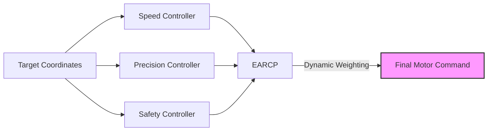
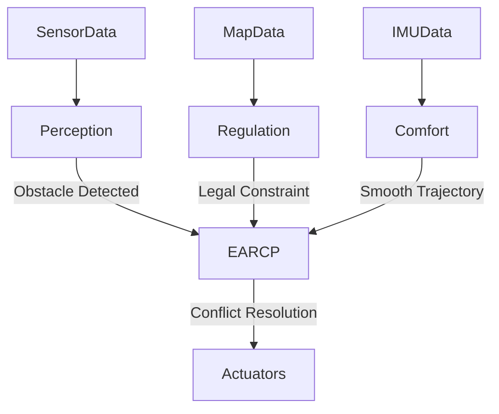
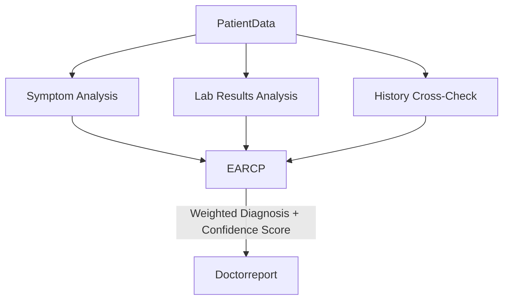

# EARCP: Ensemble Auto-Régulé par Coherence et Performance


EARCP is a lightweight, powerful orchestration library for Large Language Models (LLMs) and complex decision-making systems. It enables you to create "virtual experts" from a single model or distinct modules, dynamically weighting their outputs based on consensus (coherence) and quality (performance).

**Turn one model into a robust team of experts without fine-tuning.**

## Table of Contents
- [Features](#features)
- [Installation](#installation)
- [Core Concept](#core-concept)
- [Industry Applications](#industry-applications)
    - [Robotics](#1-robotics-precision-vs-safety)
    - [Autonomous Driving](#2-autonomous-driving-multi-objective-fusion)
    - [Medicine](#3-medicine-diagnostic-reliability)
    - [Advanced LLM Agents](#4-advanced-llm-agents)
- [Quick Start](#quick-start)
- [Mechanism](#how-it-works)
- [License](#license)
```

## Core Concept: Single Model, Multiple Behaviors

**The Problem with Fine-Tuning**
Traditional approaches to specialize LLMs involve "Fine-Tuning": training a new model for every sub-task. This is expensive (GPU time), rigid (requires re-training for changes), and creates an MLOps nightmare (managing dozens of multi-GB files).

**The EARCP Solution**
EARCP extracts **diversity** from a **single, frozen model**. By modulating inference parameters like `Temperature`, `Top-P`, or `System Prompts`, we create "Virtual Experts":

*   **Factual Expert ($T=0.1$)**: Deterministic, precise.
*   **Creative Expert ($T=1.3$)**: Divergent, imaginative.

EARCP dynamically mixes these behaviors. **Result:** You get the benefits of an Ensemble Mixture-of-Experts (MoE) with simple software configuration, **zero training cost**, and minimal infrastructure.

## Industry Applications

EARCP is not limited to text generation. It is a general-purpose **Ensemble Decision Framework**. Here is how it applies to critical industries.

### 1. Robotics: Precision vs. Safety

In robotics, a manipulator arm must balance speed, precision, and safety. A single controller often struggles to optimize all three simultaneously.

**The EARCP Setup:**
*   **Expert A (Speed):** Optimized for minimizing movement time (Aggressive).
*   **Expert B (Precision):** Optimized for exact positioning (Slow).
*   **Expert C (Safety):** Optimized for collision avoidance (Conservative).

**Orchestration Logic:**
EARCP continually evaluates the *Coherence* (do the trajectories agree?) and *Performance* (is the path valid?). during a delicate operation, the "Safety" and "Precision" experts will naturally gain higher weight, overriding the "Speed" expert.



### 2. Autonomous Driving: Multi-Objective Fusion

Self-driving cars must process perception data, legal constraints, and passenger comfort.

**The EARCP Setup:**
*   **Perception Expert:** Identifies obstacles (Pedestrians, cars).
*   **Regulation Expert:** Hard-coded traffic rules (Stop signs, speed limits).
*   **Comfort Expert:** Smooth acceleration/braking curves.

**Scenario:** A car detects a sudden obstacle.
1.  **Perception** screams "STOP".
2.  **Comfort** suggests "Slow down gently".
3.  **Regulation** says "Stay in lane".
4.  **EARCP** detects low coherence but high performance risk from Perception. It shifts weight immediately to Perception + Regulation, executing a hard emergency stop, sacrificing Comfort.



### 3. Medicine: Diagnostic Reliability

In medical diagnosis, avoiding "hallucinations" (false positives/negatives) is critical.

**The EARCP Setup:**
*   **Symptom Expert:** Analyzes patient reports (NLP).
*   **Lab Expert:** Analyzes blood work and numerical data (Statistics).
*   **History Expert:** Checks patient's past records (Knowledge Graph).

**Orchestration Logic:**
If the Symptom Expert suggests "Condition X" but the Lab Expert strongly contradicts it (Low Coherence), EARCP lowers the confidence score and flagging the case for human review, rather than outputting a confident but wrong diagnosis.



### 4. Advanced LLM Agents

For general chat and reasoning, we use the standard implementation to reduce hallucinations.

**The EARCP Setup:**
*   **Factual Expert (T=0.1):** Ground truth.
*   **Creative Expert (T=1.2):** Ideation.
*   **Critic Expert (System Prompt):** "You are a critic. Verify inputs."

---

## Quick Start

### 1. Define Your Experts

Experts are just wrappers around your model (LLM or otherwise).

```python
import openai
from earcp import EARCP

class LLMExpert:
    def __init__(self, temperature, system_prompt):
        self.temperature = temperature
        self.system_prompt = system_prompt

    def predict(self, prompt: str) -> str:
        # Example using OpenAI API
        response = openai.chat.completions.create(
            model="gpt-4", 
            messages=[
                {"role": "system", "content": self.system_prompt},
                {"role": "user", "content": prompt}
            ],
            temperature=self.temperature
        )
        return response.choices[0].message.content

# Initialize a diverse team for General Purpose
experts = [
    LLMExpert(0.1, "You are a factual assistant. Be precise."),
    LLMExpert(1.2, "You are a creative assistant. Think outside the box.")
]
```

### 2. Initialize EARCP

```python
earcp = EARCP(
    experts=experts,
    alpha_P=0.9,  # Performance smoothing factor
    alpha_C=0.8,  # Coherence smoothing factor
    beta=0.7,     # Weight given to Performance vs Coherence
    eta_s=4.0,    # Softmax sensitivity
    w_min=0.05    # Minimum weight per expert
)
```

### 3. Run Inference Loop

```python
user_prompt = "Explain the impact of quantum computing on cryptography."
responses = [exp.predict(user_prompt) for exp in experts]
final_response, internal_weights = earcp.predict(responses)

print("Final Response:", final_response)
print("Current Expert Weights:", internal_weights)
```

## How It Works

EARCP calculates a dynamic weight $w_i$ for each expert $i$ at every step:

$$ w_i(t+1) = \text{softmax}( \beta \cdot P_i(t) + (1-\beta) \cdot C_i(t) ) $$

-   **Performance ($P$)**: How good was this specific answer? (External signal)
-   **Coherence ($C$)**: How much does this answer agree with the other experts? (Internal signal)

## Theoretical Guarantees

EARCP is not just a heuristic; it is grounded in **Online Learning Theory**.

### 1. Model Agnosticism (Heterogeneous Ensembles)
Unlike traditional MoE (Mixture of Experts) which often requires experts to share architecture, EARCP is **completely agnostic**.
*   **Expert A** could be GPT-4.
*   **Expert B** could be a lightweight Llama-3-8B.
*   **Expert C** could be a Random Forest classifier.
EARCP orchestrates them solely based on their outputs and performance scores, enabling powerful **heterogeneous ensembles**.

### 2. Regret Bound (Provable Stability)
We provide a theoretical guarantee on the **Regret**, defined as the difference between the cumulative loss of the EARCP algorithm and that of the best fixed expert in hindsight.

$$ R(T) = \sum_{t=1}^T l_t(\text{EARCP}) - \min_{i} \sum_{t=1}^T l_t(\text{Expert}_i) $$

EARCP guarantees a **sub-linear regret bound** $O(\sqrt{T \ln N})$, meaning that as time $T \to \infty$, the average performance of EARCP **converges** to the performance of the best single expert in the pool. This provides a hard mathematical safety net: **you cannot do worse than your best expert in the long run.**

## License

This software is released under the **Business Source License (BSL 1.1)**.
-   **Free for Non-Commercial Use**: Research, personal projects, and testing.
-   **Commercial License Required**: For production deployments.
